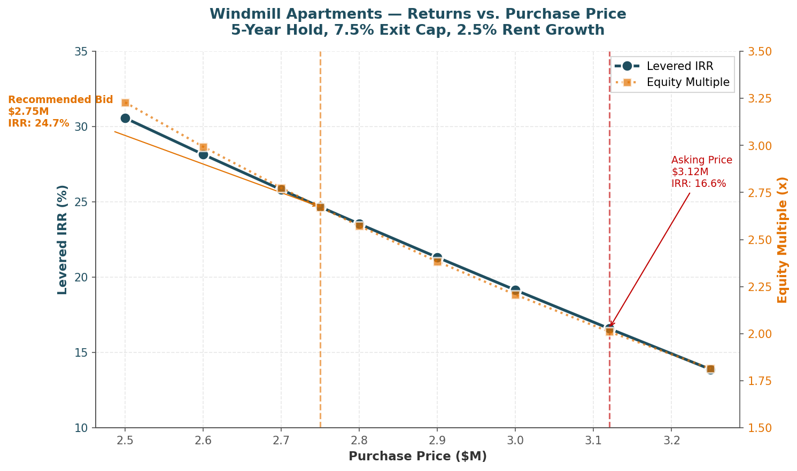
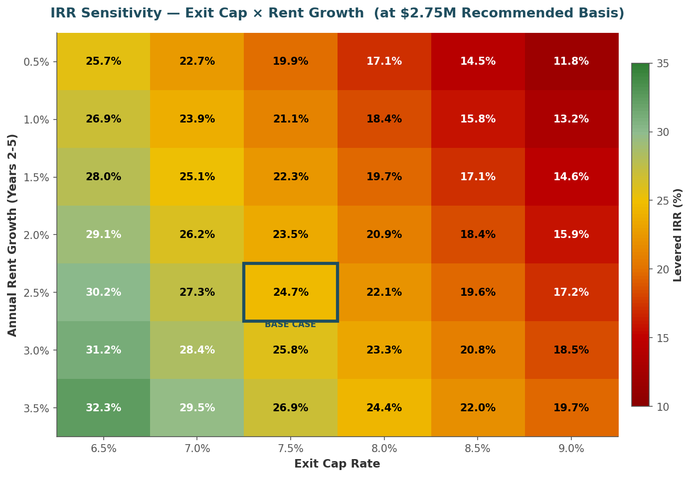
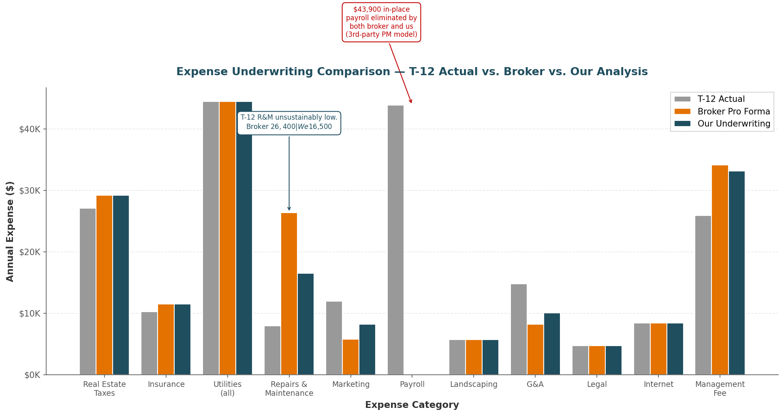

# Windmill Apartments — Value-Add Multifamily Acquisition Underwriting

**A full institutional-quality underwriting of a live 33-unit Class C multifamily property in Indianapolis, IN.**
Live Marcus & Millichap listing → OM request → rent roll & T-12 diligence → independent rent comp verification → Excel pro forma → sensitivity analysis → investment committee memo.

---

## The Deal

| | |
|---|---|
| **Property** | Windmill Apartments, 10705 E US Highway 136, Indianapolis, IN 46234 |
| **Broker** | Marcus & Millichap |
| **Asking Price** | $3,120,000 ($94,545/unit) |
| **Unit Count** | 33 (15 Studios / 17 1BR / 1 2BR), built 1980 |
| **In-Place T-12 NOI** | $212,574 |
| **In-Place Cap Rate** | 6.81% (on asking price) |

## The Recommendation

**Pass at ask.** Buy at up to **$2,750,000**.

The base case at asking price (16.6% IRR) collapses under moderate stress: a 100bp exit cap expansion drops IRR to 11.0%, and a soft rent growth environment drops it to 5.4%. At $2,750,000, the same stress scenarios still produce 19-20% IRR — a genuinely asymmetric downside profile that justifies the $370K price discount.

**The $370K discount is downside insurance, not opportunistic upside.**

---

## Returns at Recommended Basis ($2,750,000)

| Metric | Value |
|---|---|
| Base Case Levered IRR | **24.7%** |
| Base Case Equity Multiple | **2.67x** |
| Year 1 Cash-on-Cash | 10.2% |
| Year 1 DSCR | 1.62x |
| Going-in Cap Rate | 9.50% |
| Loan / LTV | $1.925M / 70% |
| Equity Required | $880,000 |

---

## Key Findings

**1. Broker's cap rate is inflated by $35K of NOI normalization.**
The OM claims a 7.95% cap. The actual T-12 NOI is $212,574 — a **6.81% cap** on asking price. The gap comes from removing all $43,900 of in-place payroll, cutting marketing 50%, and reducing G&A. Some of that is defensible (third-party PM model), some isn't. See `analysis/broker_vs_our_underwriting.md`.

**2. The "below-market rent" story is largely false.**
Broker claims Windmill rents are 6% below market. Independent rent-comp verification (Apartments.com, July 2026 — pulled 11 comps) shows Windmill studios and 1BRs are **at or above** per-square-foot market rents. Unit size (226-506 sqft) is the binding constraint, not price. See `analysis/rent_comps.md`.

**3. Real upside is operational, not rent-driven.**
Third-party PM eliminates $43,900 of in-place payroll (replaced by $33K management fee), and ~$7K/unit of interior capex on 5 remaining unrenovated units brings them to renovated rent. Modest but real. The thesis does not depend on rent inflation.

---

## Sensitivity Analysis

### Returns vs. Purchase Price


Dropping the purchase price 12% (from $3.12M to $2.75M) lifts IRR from 16.6% to 24.7%. The relationship is asymmetric — you're simultaneously lowering the equity denominator, lowering debt service, and increasing exit gain. Small price moves create disproportionate IRR change.

### IRR Sensitivity Heatmap — Exit Cap × Rent Growth (at $2.75M)


At the recommended basis, **every scenario in the observable range produces IRR above 11.8%**. The worst-case combination (0.5% rent growth + 9.0% exit cap) still returns 11.8%. Compare to asking price where the same scenario returns negative levered IRR — the price discount buys real insurance.

### Expense Underwriting — T-12 Actual vs. Broker vs. Our Analysis


Where our underwriting diverges from the broker: we normalize R&M higher than T-12 (which was unsustainably low), keep marketing at $250/unit (broker cut it in half), and preserve G&A at OM-stated levels. Net effect: our Year 1 expense load is realistic, not aspirational.

---

## Repository Contents

```
windmill-multifamily-underwriting/
├── README.md                         ← You are here
├── model/
│   └── Windmill_Underwriting_Model.xlsx    ← 10-tab underwriting workbook
├── memo/
│   ├── Windmill_IC_Memo.pdf                ← 4-page investment committee memo
│   └── Windmill_IC_Memo.docx               ← Editable Word version
├── analysis/
│   ├── rent_comps.md                       ← Independent Apartments.com comp analysis
│   └── broker_vs_our_underwriting.md       ← Line-by-line divergence from OM
├── visualizations/
│   ├── 1_returns_by_purchase_price.png
│   ├── 2_sensitivity_heatmap.png
│   └── 3_expense_comparison.png
└── data/
    ├── sensitivity_results.csv             ← Raw scenario outputs
    └── unit_mix_summary.csv                ← Rent roll summary
```

---

## Methodology

- **Source documents:** Marcus & Millichap OM (dated 6/29/2026), Yardi rent roll (5/26/2026), 12-month operating statement (May 2025 – April 2026).
- **Model:** Excel workbook with 10 linked tabs — Cover, Assumptions, Rent Roll, T-12, Pro Forma, Debt Schedule, 5-Year Cash Flow, Returns, Sensitivity, Rent Comps. All 322 formulas trace back to the Assumptions tab.
- **Rent comp verification:** 11 comparable properties pulled from Apartments.com (July 2026), spanning studios and 1BRs within 15 miles.
- **Debt assumption:** 70% LTV / 6.75% fixed / 25-year amortization / 5-year term — reflects current bank multifamily terms.
- **Exit assumption:** 7.5% exit cap rate — reflects 50bp expansion vs. Brownsburg submarket cap of 6.38% per OM.

---

## About This Project

This is an independent analytical exercise, not investment advice. All figures are derived from the broker's stated financial disclosures plus independent market research. Any acquisition decision would require full due diligence, physical inspection, environmental review, and updated market data.

The project was completed to demonstrate end-to-end multifamily underwriting capability — from OM interpretation through pro forma construction, sensitivity analysis, and investment committee-level recommendation.

**Prepared by:** Balaji Mediboina
**Date:** July 2026
**Contact:** [LinkedIn](https://linkedin.com/in/balajimediboina) | balajimediboina212@gmail.com
